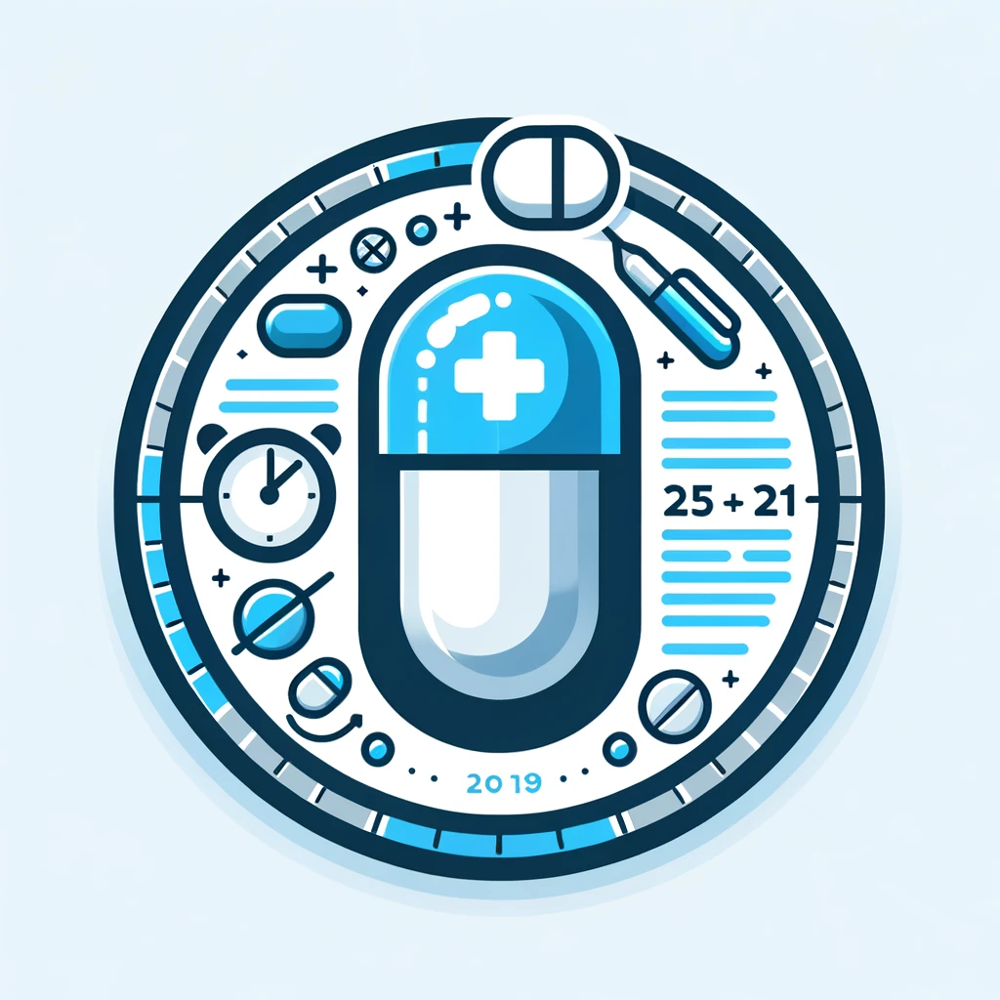

# med-advisor



### Setup

Clone the repository:
```sh
$ git clone https://github.com/azizbek-kobilov/med-advisor.git
$ cd med-advisor
```

Create a virtual environment:
```sh
$ python -m venv env
$ source env/bin/activate
```

Install the dependencies:
```sh
(env)$ pip install -r requirements.txt
```

In the root of the project create a .env file and set the environment variables
```sh
# Environment
ENVIRONMENT = 'production'

# ChatGPT API Key
CHATGPT_API_KEY = 

# Django Secret Key
SECRET_KEY = 

# Telegram token
BOT_TOKEN = 
```

Migrate database:
```sh
(env)$ python manage.py migrate
```

Create superuser:
```sh
(env)$ python manage.py createsuperuser
```

Run project:
```sh
(env)$ python manage.py runserver
```

Run telegram bot:
```sh
(env)$ python manage.py runbot
```
